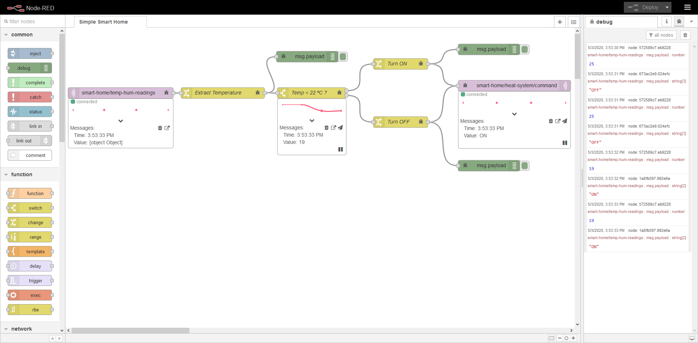
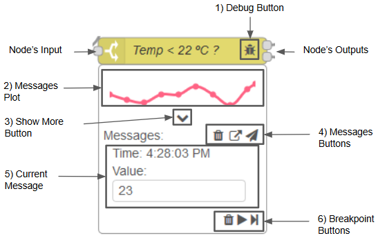

# CAULDRON

**CAULDRON**: Capacitating Agile Users with Live Debugging Resources On Node-RED, is a modified version of [Node-RED](https://nodered.org/).


## Features

Node-RED was modified in order to increase the system’s observability and enhancing the debug capabilities.

This modified tool provides as main features:
- The ability to show the information which flows through the nodes using different visual metaphors.
  
- The injection of messages at runtime.
  
- Enhanced debugging capabilities through breakpoints on each node.


With our approach, each node presents new inputs as they are received. However, in nodes without any input, the output is shown instead. This special case ensures that we can see all the information flowing through all the nodes, regardless of their position in the flow. In nodes without inputs, the inject message and the breakpoint functionalities are not available, since they are related to input messages.

## Gallery

| |
|:-:|
| User interface of **CAULDRON** |
| |
| A `Switch` node as example, where it is observable the added features|
||

## How to run

```
git clone https://github.com/diogotorres97/nodered-cauldron.git
cd nodered-cauldron
npm install
npm run build
npm start
```